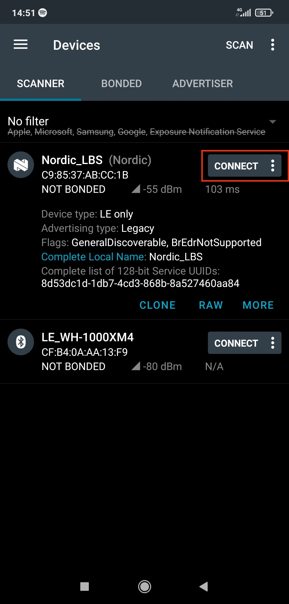
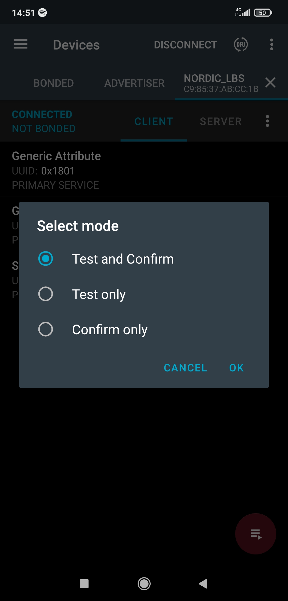

# Zephry Project notes <!-- omit in toc -->

NOTE: This document was written with intention of beinge a general guide, but there are some specifics to that apply to nRF52840dk.

- [1. Installation](#1-installation)
  * [1.1. Dependencies](#11-dependencies)
  * [1.2. Zephyr and Python dependencies](#12-zephyr-and-python-dependencies)
  * [1.3. Building and Flashing](#13-building-and-flashing)
  * [1.4. Supported Boards](#14-supported-boards)
- [2. Programming](#2-programming)
  * [2.1. GPIO](#21-gpio)
  * [2.2. Threads](#22-threads)
    * [2.2.1. Note on Thread Priorities](#221-note-on-thread-priorities)
- [3. MCUBoot](#3-mcuboot)
  * [3.1. Build and Flash Bootloader](#31-build-and-flash-bootloader)
  * [3.2. Flashing with west](#32-flashing-with-west)
  * [3.3. Flashing with pyocd](#33-flashing-with-pyocd)
  * [3.4. Flashing with mcumgr](#34-flashing-with-mcumgr)
    * [3.4.1. Install mcumgr](#341-install-mcumgr)
    * [3.4.2. Add DFU support to application](#342-add-dfu-support-to-application)
    * [3.4.3. Testing and upgrading images](#343-testing-and-upgrading-images)
  * [3.5. Flashing with mcumgr via Bluetooth](#35-flashing-with-mcumgr-via-bluetooth)
    * [3.5.1. Add Bluetooth DFU support to application](#351-add-bluetooth-dfu-support-to-application)
    * [3.5.2. mcumgr](#352-mcumgr)
    * [3.5.3. nRF Connect for mobile](#353-nrf-connect-for-mobile)
    * [3.5.4. Solving issues](#354-solving-issues)


## 1. Installation 

### 1.1. Dependencies
  
| Tool | Version |
|------|---------|
| Cmake | 3.20.0 |
| Python | 3.6 |
| Device tree compiler | 1.4.6 |

Download Kitware archive script:

    wget https://apt.kitware.com/kitware-archive.sh
    sudo bash kitware-archive.sh

 Download required dependencies: 

    sudo apt install --no-install-recommends git cmake ninja-build gperf \
      ccache dfu-util device-tree-compiler wget \
      python3-dev python3-pip python3-setuptools python3-tk python3-wheel xz-utils file \
      make gcc gcc-multilib g++-multilib libsdl2-dev

<br>

### 1.2. Zephyr and Python dependencies

Install west and adding `~/.local/bin` to `PATH`:

    pip3 install --user -U west
    echo 'export PATH=~/.local/bin:"$PATH"' >> ~/.bashrc
    source ~/.bashrc

Get Zephyr source code;

    west init ~/zephyrproject
    cd ~/zephyrproject
    west update

Export a Zephyr CMake package:

    west zephyr-export

Install additional Python dependencies:

    pip3 install --user -r ~/zephyrproject/zephyr/scripts/requirements.txt

<br>

### 1.3. Building and Flashing

Build application with west build, changing <your-board-name> to used board and <path/to/application/folder>

    cd ~/zephyrproject/zephyr
    west build -p auto -b <your-board-name> <path/to/application/folder>

To flash application use `west flash`:

    west flash

Sample applications are located in `/samples`

<br>

### 1.4. Supported Boards

IDs of supported boards, their device trees and documentations are located in `/boards`. List of supported boards can also be accessed with:

	west boards

[Reference](https://docs.zephyrproject.org/latest/getting_started/index.html)

<br>

## 2. Programming

This chapter includes simple example code for programming with Zephyr SDK. For more information about API go to [API References](https://docs.zephyrproject.org/latest/reference/index.html).

### 2.1. GPIO

Simple blinky example:
```cpp

/* get pointers to GPIO device, pin number of device and pin configuration flags for this device from device tree*/
static const struct gpio_dt_spec led = GPIO_DT_SPEC_GET(LED0_NODE, gpios); 

void main(void)
{
    gpio_pin_configure_dt(&led, GPIO_OUTPUT_INACTIVE); // configure led pin as output and initalize it to logic 0
    while (1) 
    {
        gpio_pin_toggle_dt(&led); // toggle led
        k_msleep(1000); // put this thread to sleep
    }
}
```

[GPIO API Reference](https://docs.zephyrproject.org/latest/reference/peripherals/gpio.html)

### 2.2. Threads

Thread blinky example:
```cpp
/* size of stack area used by each thread */
#define STACKSIZE 1024

/* scheduling priority used by each thread */
#define PRIORITY 2

static struct gpio_dt_spec led0 = GPIO_DT_SPEC_GET_OR(DT_ALIAS(led0), gpios,{0});
static struct gpio_dt_spec led1 = GPIO_DT_SPEC_GET_OR(DT_ALIAS(led1), gpios,{0});

void blink0(void)
{
	gpio_pin_configure_dt(&led0, GPIO_OUTPUT_INACTIVE);
	while(1) 
    {
		gpio_pin_toggle_dt(&led0);
		k_msleep(100);
	}
}

void blink1(void)
{
	gpio_pin_configure_dt(&led1, GPIO_OUTPUT_INACTIVE);
	while(1) 
    {
		gpio_pin_toggle_dt(&led1);
		k_msleep(1000);
	}
}
 
/* create tasks */ 
K_THREAD_DEFINE(blink0_id, STACKSIZE, blink0, NULL, NULL, NULL, PRIORITY, 0, 0);
K_THREAD_DEFINE(blink1_id, STACKSIZE, blink1, NULL, NULL, NULL, PRIORITY, 0, 0);
```
<br>

### 2.2.1. Note on Thread Priorities

A thread priority can be a non-negative or negative integer value and is inversly proportional to task priority. If task A has priority of 3 and task B priority of 5,  scheduler gives higher priority to task A.

[Threads API Reference](https://docs.zephyrproject.org/latest/reference/kernel/threads/index.html#api-reference)

<br>

## 3. MCUBoot

### 3.1. Build and Flash Bootloader

Build MCUboot bootloader with `west build`:

	cd ~/zephyrproject
	west build -b YOUR_BOARD -s bootloader/mcuboot/boot/zephyr -d build-mcuboot

Flash bootloader:

	west flash -d build-mcuboot


Output on serial monitor should look like this:

    *** Booting Zephyr OS build zephyr-v3.0.0-2126-g65a2e4b76008  ***
    I: Starting bootloader
    I: Primary image: magic=unset, swap_type=0x1, copy_done=0x3, image_ok=0x3
    I: Secondary image: magic=unset, swap_type=0x1, copy_done=0x3, image_ok=0x3
    I: Boot source: none
    W: Failed reading image headers; Image=0
    E: Unable to find bootable image

<br>

### 3.2. Flashing with west

Building and flashing hello_world sample application:

	west build -b YOUR_BOARD -s zephyr/samples/hello_world -d build-hello-signed -- -DCONFIG_BOOTLOADER_MCUBOOT=y -DCONFIG_MCUBOOT_SIGNATURE_KEY_FILE=\"bootloader/mcuboot/root-rsa-2048.pem\"

	west flash -d build-hello-signed

After restarting the board, serial output should look like this:

    *** Booting Zephyr OS build zephyr-v3.0.0-2126-g65a2e4b76008  ***
    I: Starting bootloader
    I: Primary image: magic=unset, swap_type=0x1, copy_done=0x3, image_ok=0x3
    I: Secondary image: magic=unset, swap_type=0x1, copy_done=0x3, image_ok=0x3
    I: Boot source: none
    I: Swap type: none
    I: Bootloader chainload address offset: 0xc000
    I: Jumping to the first image slot
    *** Booting Zephyr OS build zephyr-v3.0.0-2126-g65a2e4b76008  ***
    Hello World from Zephyr on nrf52840dk_nrf52840!

To upgrade images see chapters 3.3. and preferably 3.4.

[Reference](https://docs.zephyrproject.org/3.0.0/guides/west/sign.html)

<br>

### 3.3. Flashing with pyocd

To flash image to specific address we will use pyocd:
	
	python3 -mpip install -U pyocd

Build image:

	west build -b YOUR_BOARD -s zephyr/samples/hello_world -d build-hello-update-signed -- -DCONFIG_BOOTLOADER_MCUBOOT=y -DCONFIG_MCUBOOT_SIGNATURE_KEY_FILE=\"bootloader/mcuboot/root-rsa-2048.pem\"


Sign image with imgtool.py. This example uses private key that is publicly available. For production generate your own keys.

	bootloader/mcuboot/scripts/imgtool.py sign --key bootloader/mcuboot/root-rsa-2048.pem --header-size 0x200 --align 8 --version 1.3 --slot-size 0x67000 --pad build-hello-update-signed/zephyr/zephyr.bin signed-updated-hello.bin

Image needs to be written to memory addres of slot 1 partition. Address can be found in ~/zephyrproject/zephyr/boards in .dts file of the board. Example for nrf52840dk_nrf52840:

	&flash0 {

		partitions {
			compatible = "fixed-partitions";
			#address-cells = <1>;
			#size-cells = <1>;

			boot_partition: partition@0 {
				label = "mcuboot";
				reg = <0x000000000 0x0000C000>;
			};
			slot0_partition: partition@c000 {
				label = "image-0";
				reg = <0x0000C000 0x00067000>;
			};
			slot1_partition: partition@73000 {
				label = "image-1";
				reg = <0x00073000 0x00067000>;
			};
			scratch_partition: partition@da000 {
				label = "image-scratch";
				reg = <0x000da000 0x0001e000>;
			};

			/*
			* The flash starting at 0x000f8000 and ending at
			* 0x000fffff is reserved for use by the application.
			*/

			/*
			* Storage partition will be used by FCB/LittleFS/NVS
			* if enabled.
			*/
			storage_partition: partition@f8000 {
				label = "storage";
				reg = <0x000f8000 0x00008000>;
			};
		};
	};


Flash image	with `pyocd flash` to address 0x73000. 

	pyocd flash -a 0x73000 -t nrf52840 signed-updated-hello.bin

Serial output should look like this:

	*** Booting Zephyr OS build zephyr-v3.0.0-2316-g2a9b2dd7b950  ***
	I: Starting bootloader
	I: Primary image: magic=good, swap_type=0x4, copy_done=0x1, image_ok=0x1
	I: Secondary image: magic=good, swap_type=0x1, copy_done=0x3, image_ok=0x3
	I: Boot source: none
	I: Swap type: test
	I: Starting swap using move algorithm.
	I: Bootloader chainload address offset: 0xc000
	I: Jumping to the first image slot
	*** Booting Zephyr OS build zephyr-v3.0.0-2316-g2a9b2dd7b950  ***
	Hello World! This is Updated image nrf52840dk_nrf52840

`Swap type: test` means that if upgrade image is not confirmed it will be reverted to primary image after reset (`Swap type: revert`):

	*** Booting Zephyr OS build zephyr-v3.0.0-2316-g2a9b2dd7b950  ***
	I: Starting bootloader
	I: Primary image: magic=good, swap_type=0x2, copy_done=0x1, image_ok=0x3
	I: Secondary image: magic=unset, swap_type=0x1, copy_done=0x3, image_ok=0x3
	I: Boot source: none
	I: Swap type: revert
	I: Starting swap using move algorithm.
	I: Secondary image: magic=unset, swap_type=0x1, copy_done=0x3, image_ok=0x3
	I: Bootloader chainload address offset: 0xc000
	I: Jumping to the first image slot
	*** Booting Zephyr OS build zephyr-v3.0.0-2316-g2a9b2dd7b950  ***
	Hello World! nrf52840dk_nrf52840

To upgrade permanently add --confirm to sign image command.

[Reference]( https://www.methodpark.de/blog/a-setup-for-firmware-updates-over-the-air-part-3-wireless-sensor-nodes-mcuboot/)

[Other reference](https://github.com/mcu-tools/mcuboot/blob/main/docs/readme-zephyr.md)

<br>

### 3.4. Flashing with mcumgr

### 3.4.1. Install mcumgr

Install `go`:

	sudo add-apt-repository ppa:longsleep/golang-backports
	sudo apt update
	sudo apt install golang-go

Install `mcumgr` with `go`:

	go install github.com/apache/mynewt-mcumgr-cli/mcumgr@latest

Add `mcumgr` to `PATH`:

	vim ~/.bashrc
	export PATH="/home/USER/mcumgr/mcumgr":$PATH
	source ~/.bashrc

<br>

### 3.4.2. Add DFU support to application

Add these lines to prj.conf:
	
	# Enable mcumgr.
	CONFIG_MCUMGR=y

	# Enable most core commands.
	CONFIG_MCUMGR_CMD_IMG_MGMT=y
	CONFIG_MCUMGR_CMD_OS_MGMT=y

	# Ensure an MCUboot-compatible binary is generated.
	CONFIG_BOOTLOADER_MCUBOOT=y

	# Enable the serial mcumgr transport.
	CONFIG_MCUMGR_SMP_UART=y

	# Disable UART Console and enable the RTT console
	CONFIG_UART_CONSOLE=n
	CONFIG_RTT_CONSOLE=y
	CONFIG_USE_SEGGER_RTT=y

	# Some command handlers require a large stack.
	CONFIG_SYSTEM_WORKQUEUE_STACK_SIZE=4096

Add next statemens at the top of main.c

	#include "os_mgmt/os_mgmt.h"
	#include "img_mgmt/img_mgmt.h"

Add following lines to the start of main function:

	printk("build time: " __DATE__ " " __TIME__ "\n");
	os_mgmt_register_group();
	img_mgmt_register_group();

<br>

### 3.4.3. Testing and upgrading images

Build and flash image:

	west build -p -b YOUR_BOARD -s zephyr/samples/basic/blinky -d build-blinky-signed -- -DCONFIG_BOOTLOADER_MCUBOOT=y -DCONFIG_MCUBOOT_SIGNATURE_KEY_FILE=\"bootloader/mcuboot/root-rsa-2048.pem\"
	west flash -d build-blinky-signed


Run `mcumgr image list` to list images:

	mcumgr --conntype="serial" --connstring="dev=/dev/ttyACM0,baud=115200,mtu=512" image list

	Images:
	 image=0 slot=0
		version: 0.0.0
		bootable: true
		flags: active confirmed
		hash: 6ec911e7b419d35a616582f74e10f3f0bf20d09d61da35ab84f7d3245526c8f6
	 image=0 slot=1
		version: 0.0.0
		bootable: true
		flags: 
		hash: 23998a5ad52ff49107c2104dc5ab68d52e51fccc87b8390164110e916d0067bd
	Split status: N/A (0)


To save connection config use:

	mcumgr conn add acm0 type="serial" connstring="dev=/dev/ttyACM0,baud=115200,mtu=512"

Config can be accessed with:

	mcumgr -c acm0

Make some changes to main.c, rebuild image and uploade update with `mcumgr image upload`:

	mcumgr <connection-options> image upload -e  [-n] [-u] <signed-bin>

	mcumgr -c acm0 image upload -e build-blinky-update-signed/zephyr/zephyr.signed.bin

After upload check run `image list` again to get hash of image in slot 1:

	Images:
	 image=0 slot=0
		version: 0.0.0
		bootable: true
		flags: active confirmed
		hash: 6ec911e7b419d35a616582f74e10f3f0bf20d09d61da35ab84f7d3245526c8f6
	 image=0 slot=1
		version: 0.0.0
		bootable: true
		flags: 
		hash: 320f4fc179f8980065b9eeb222e9e12266da8b8e60fc4ca70c1ad49ba95bbd8a
	Split status: N/A (0)


Test image:

	mcumgr <connection-options> image test <hash>

	mcumgr -c acm0 image test 9918ff0e7cd5ff3cdecd647005063a5fc1df8b1c3a07f9e1b23e02f8854a61ea

	Images:
	 image=0 slot=0
		version: 0.0.0
		bootable: true
		flags: active confirmed
		hash: aefd063a5f4d7c0690ec769944fd7fa843e2beb36594ab1fa0fe59e3a89a349c
	 image=0 slot=1
		version: 0.0.0
		bootable: true
		flags: pending
		hash: 9918ff0e7cd5ff3cdecd647005063a5fc1df8b1c3a07f9e1b23e02f8854a61ea
	Split status: N/A (0)

MCUboot will swap images after performing a reset:

	mcumgr <connection string> reset


After another reset images will be swaped again. Permanently confirm image:

	mcumgr <connection-options> image confirm [hash]

	mcumgr -c acm0 image confirm

You can swap images again if you perform `confirm` with specific hash.

[mcumgr reference](https://docs.zephyrproject.org/latest/services/device_mgmt/mcumgr.html)

[Nordic semi reference](https://devzone.nordicsemi.com/guides/nrf-connect-sdk-guides/b/software/posts/ncs-dfu)

<br>

### 3.5. Flashing with mcumgr via Bluetooth

### 3.5.1. Add Bluetooth DFU support to application

Add these lines to proj.conf:

	# Enable mcumgr.
	CONFIG_MCUMGR=y

	# Enable most core commands.
	CONFIG_MCUMGR_CMD_IMG_MGMT=y
	CONFIG_MCUMGR_CMD_OS_MGMT=y

	# Ensure an MCUboot-compatible binary is generated.
	CONFIG_BOOTLOADER_MCUBOOT=y

	# Allow for large Bluetooth data packets.
	CONFIG_BT_L2CAP_TX_MTU=252
	CONFIG_BT_BUF_ACL_RX_SIZE=256

	# Enable the Bluetooth (unauthenticated) and shell mcumgr transports.
	CONFIG_MCUMGR_SMP_BT=y
	CONFIG_MCUMGR_SMP_BT_AUTHEN=n

	# Some command handlers require a large stack.
	CONFIG_SYSTEM_WORKQUEUE_STACK_SIZE=4096

Add following statements to main.c:

	#include <mgmt/mcumgr/smp_bt.h>
	#include "os_mgmt/os_mgmt.h"
	#include "img_mgmt/img_mgmt.h"

Remove the LBS Service UUID from the scan response packet, and replace it with the SMP service UUID:

	BT_DATA_BYTES(BT_DATA_UUID128_ALL,
		      0x84, 0xaa, 0x60, 0x74, 0x52, 0x8a, 0x8b, 0x86,
		      0xd3, 0x4c, 0xb7, 0x1d, 0x1d, 0xdc, 0x53, 0x8d),

Put these lines right before bt_conn_cb_register:

	printk("build time: " __DATE__ " " __TIME__ "\n");
	os_mgmt_register_group();
	img_mgmt_register_group();
	smp_bt_register();

Build image the same way as before.

<br>

### 3.5.2. mcumgr

Flashing with mcumgr is very similar to [3.4.3. Testing and upgrading images](#343-testing-and-upgrading-images), we only need to change connection type and connection string. Characters in MAC address need to be lower case. To scan for MAC address we can use `hcitool lescan`.

	sudo mcumgr --conntype ble --connstring ctlr_name=hci0,peer_id=MAC_ADDRESS image upload /path/to/signed.bin

Add new connection config:

	mcumgr conn add blue type="ble" connstring="ctlr_name=hci0,peer_id=<MAC_ADDRESS>" 

Upload example: 

	sudo go/bin/mcumgr -c blue image upload zephyrproject/build-bluetooth-led-signed/zephyr/zephyr.signed.bin

<br>

### 3.5.3. nRF Connect for mobile

Download nRF Connect on smartphone, open the app and hit scan. Tap on CONNECT for desired device.



Next tap DFU and select signed binary to upgrade to.


Select which action you want to perform.



<br>

### 3.5.4. Solving issues

For nRF52840 disable Mass Storage Device with [JLinkExe](https://www.segger.com/downloads/jlink/)

	JLinkExe
	MSDDisable

When using `mcumgr` close other serial connections to MCU. You might get Error: NMP timeout and long image upload time.

Upload `zephyr.signed.bin` not `zephyr.bin` otherwise upload will stall.

[Speed up upload process mcumgr](https://devzone.nordicsemi.com/f/nordic-q-a/86191/mcuboot-slow-with-nrf52840-zephyr-usb-cdc_acm-protocol/359893)

NOTE: Due to poor documentation there were a lot of issues when trying to get mcumgr to work, so there are no guarantees this will work on other platforms.

